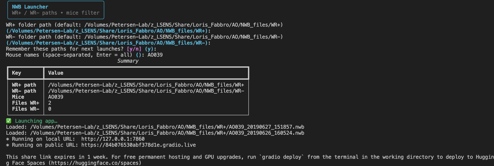

# Template Matching GUI – Adapted for NWB Files


This project is an extension of an *EPFL semester project* by Sobhan Nili focused on decoding perception of whisker stimuli in mice during an operant conditioning task.

I adapted the original project to support **NWB-formatted data** from the publication *Oryshchuk et al., 2024*, and extended the GUI for more detailed and interactive **PSTH (Peri-Stimulus Time Histogram)** visualization.

## 📚 Reference

Oryshchuk et al., *Distributed and specific encoding of sensory, motor, and decision information in the mouse neocortex during goal-directed behavior*, Cell Reports, 2024.  
👉 [DOI](https://doi.org/10.1016/j.celrep.2023.113618)


## ⚙️ Features

* **Support for NWB files**
* **Interactive GUI via Gradio for Dual analysis tabs: WR(+) and WR(–) trials**
* PSTH visualization aligned to trial onset, jaw movement... / Custom filters: stimulus amplitudes, neuron types, brain regions, quality metrics (RPV, ISI, ISO)
* Decoder parameter tuning and behavioral alignment
* Continuous perception estimation over time


## 💻 Work Environment

Create environment and Install dependencies with:
```bash
conda create -n ao-visu-310 python=3.10
conda activate ao-visu-310
pip install gradio gradio_rangeslider scipy scikit-learn pymatreader gdown pynwb matplotlib seaborn umap-learn
```
Download NWB files from the LSENS Laboratory of Sensory Processing server, or copy them locally, and place them inside the designated folder.

for exemple : 
```
./NWB_files
```

## 🧩 How to use

Whether you run the pipeline from the **terminal** or from **Jupyter**, it is essential to ensure that you are using the correct environment `ao-visu-310`.  
If you are working in *Visual Studio Code*, follow the **< Verification >** steps in the [LSENS-Lab-Immersion repository](https://github.com/loris-fab/LSENS-Lab-Immersion.git) to confirm that you are using the right environment either in the terminal when executing the pipeline there, or in Jupyter when running it from notebooks.  

Once confirmed, you can proceed with the instructions below.

### 1. Run the launcher

From the project root, execute:

```bash
python launcher.py
```

### 2. Answer the prompts

* Enter the **path to the WR(+) folder** (press Enter to reuse the last saved one).
* Enter the **path to the WR(–) folder** (or press Enter to reuse the last saved one).
* Optionally type **mouse IDs** (space-separated) to filter specific sessions, or just press Enter to include all.

**"Just to know" What the launcher does:**
The launcher scans the WR(+) and WR(–) folders to identify valid NWB files, automatically generates the `src/share.py` module containing the resolved paths and file lists, and then starts the multi-tab Gradio application with separate views for WR(+) and WR(–).


### 3. Access the app

At the end, the **terminal prints a link** (e.g., `http://127.0.0.1:7860`).
Copy and paste this link into your browser (e.g., Google Chrome) to open the GUI.


If everything has been set up correctly, your interface should now look like this. The only remaining step is to repeat the procedure for the different mouse sessions



### 4. Outcome
Once the app is running, you can select a session using the *Session Index* to view the mouse ID, date, neuron count, and trial outcomes (HIT, MISS, CR, FA). In the **PSTH panel**, configure *alignment events*, *filters* (stimulus amplitude, trial type, brain region, CCF acronym, neuron type, and quality metrics), and adjust time window or bin size. Clicking **Plot Custom PSTH** generates the plot aligned to the chosen event, which can be saved. 

Advanced panels provide further analyses such as template distances, clustering, ROC curves, confusion matrices, and continuous perception estimates.


## ✍️ Author

The original codebase was created by **Sobhan Nili**, and has been adapted for this project by @loris-fab.

For questions related to this adaptation, you can contact: loris.fabbro@epfl.ch

---

